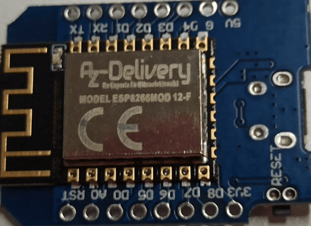
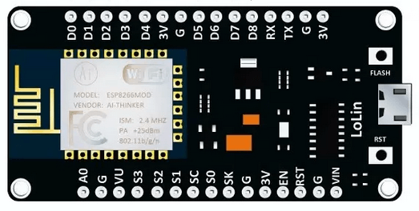
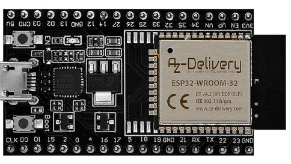

# Easy Watermeter Integration for Home Assistant

[![License][license-shield]][license]

[![ESPHome release][esphome-release-shield]][esphome-release]
[![Open in Visual Studio Code][open-in-vscode-shield]][open-in-vscode]
[![Support author][donate-me-shield]][donate-me]

[license-shield]: https://img.shields.io/static/v1?label=License&message=MIT&color=orange&logo=license
[license]: https://opensource.org/licenses/MIT

[esphome-release-shield]: https://img.shields.io/static/v1?label=ESPHome&message=2023.5.0&color=green&logo=esphome
[esphome-release]: https://GitHub.com/esphome/esphome/releases/

[open-in-vscode-shield]: https://img.shields.io/static/v1?label=+&message=Open+in+VSCode&color=blue&logo=visualstudiocode
[open-in-vscode]: https://open.vscode.dev/zibous/ha-watermeter

[donate-me-shield]: https://img.shields.io/static/v1?label=+&color=orange&message=Buy+me+a+coffee
[donate-me]: https://www.buymeacoff.ee/zibous

 

## Water meter with IZAR module (Diehl IZAR RC 868 I R4 PL)

I did some experiments with **wmbusmeters**, **DVT SDR_STICK**, **NANOCUL** and ended up with: **ESPHome - ESP32 (v4) + CC1101**.

With the NANOCUL solutions, I always had problems with the USB input and with the high resource consumption on the NUC or Raspberry computers.

 

## ESPHome + ESP32 (v4) + CC1101

ESPHome - ESP32 (v4) + CC1101 is the best solution for me because the resource requirement is low.

 

## ESP32 (v4) Variante

### Requirements

- Water meter with IZAR module (Diehl IZAR RC 868 I R4 PL),
  IZAR Radio Compact Hall is designed for mobile reading and fixed network remote reading of Diehl Metering meters.
   
- [ ESP32 Dev Kit C V4 NodeMCU](https://amzn.eu/d/eUNLyYc)
- [Fayme CC1101 868MHZ Funk ÜBertragung Antennen Transceiver Modul, Grün](https://amzn.eu/d/i5YwBkR)

### Meter types:

Currently supported meter types (wmbus 2.1.10):

- amiplus
- apator08 
- apator162
- apatoreitn
- bmeters
- compact5
- elf
- evo868
- fhkvdataiii
- hydrocalm3
- hydrus
- iperl
- itron
- **izar**
- mkradio3
- mkradio4
- qheat
- qwater
- sharky774
- topaseskr
- ultrimis
- unismart
- vario451
- ... more will come :)

see: <https://github.com/SzczepanLeon/esphome-components>

## Installation / Details
[ESPHome - ESP32 (v4) + CC1101](./esphome/README.md)

## Result

 

## ESP8266 vs ESP32 (v4)
The version with **WEMOS D1MINI (ESP8266)** was my first version. WEMOS D1MINI (ESP8266) has only limited RAM and can only be used to a limited extent. If there are too many sensors, a **JSON memory error occurs**, which causes the device to restart again and again.

The **ESP32** has more RAM memory and is therefore better suited for use.

 

|  Device | Remarks   | Hardware  | 
|---------|-----------|--------|
| **Wemos D1 Mini**  |  CC1101, board: d1_mini   |   ESP8266 80MHz, **80KB RAM**, 4MB Flash |
| **Wemos D1 Mini Board**  |  CC1101, board: esp12e (board: d1_mini )   |  ESP8266 80MHz, **80KB RAM** , 4MB Flash       |
| **NodeMCU Lolin V3 Module**    |  CC1101, board: NodeMCU Lua Lolin V3 Module ESP8266  | ESP8266 80MHz, **80KB RAM** , 4MB Flash      |
| **ESP32 Dev Kit C V4 NodeMCU**    |  CC1101, board: az-delivery-devkit-v4  |  ESP32 240MHz, **520KB RAM**, 4MB Flash     |

 

### Memory Usage D1 Mini

## Other solutions (alternatively)

- 1. [NANOCUL-DOCKER.md](NANOCUL-DOCKER.md)
- 2. [NANO-CUL.md](NANO-CUL.md)
- 3. [RB3B_DVBT - RTL232-md](RTL232.md)

### For more information see:

- <https://github.com/weetmuts/wmbusmeters>

- <https://github.com/maciekn/izar-wmbus-esp>
- <https://github.com/MariuszWoszczynski/ESPhome-IZAR-meter-reader>

- <https://github.com/SzczepanLeon/esphome-components>

- <https://osmocom.org/projects/rtl-sdr/wiki/Rtl-sdr>
- <https://github.com/xaelsouth/rtl-wmbus>
- <https://github.com/ZeWaren/izar-prios-smart-meter-collector>

#### DVB-T receiver or Nano CUL Adapter
- DVB-T receiver: <https://amzn.eu/d/8AsinRu>

- nano-cul: <https://www.smart-home-komponente.de/nano-cul/nano-cul-868-extra/>

- diehl watermeter: <https://www.diehl.com/metering/en/portfolio/software-system-components/software-system-components-products/software-system-components-product/izar-radio-compact-hall/74843/>

