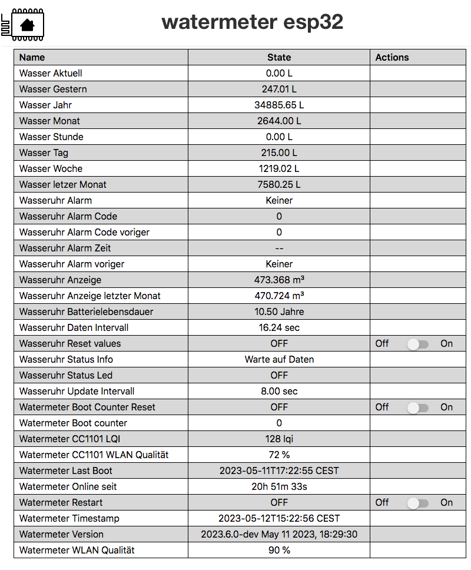
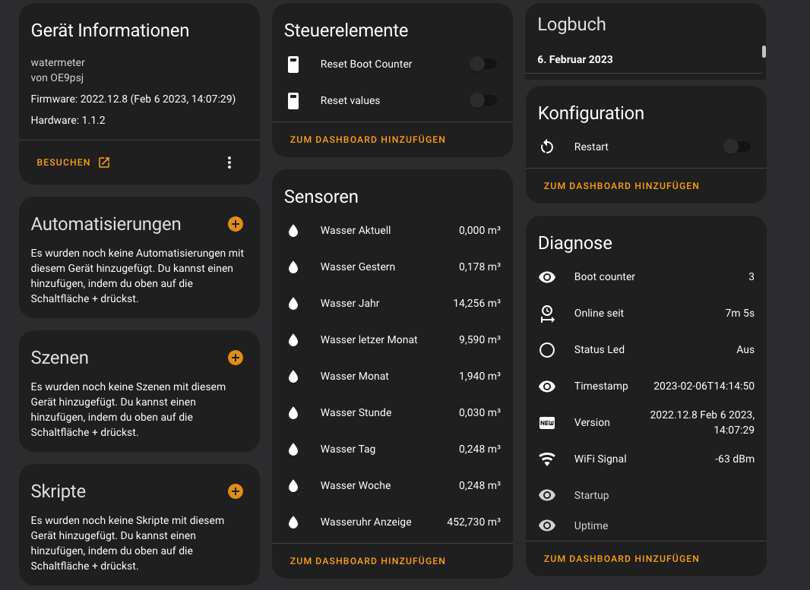

# Wemos D1 Mini + CC1101 (esphome)


### Requirements
- ESPHOME Docker
- Wemos D1 Mini
- CC1101


After Wemos D1 Mini + CC1101 has been wired, the application can be flashed with ESPHOME

```yaml
## ---------------------------------------------------
## WMBUS DEVICE D1MINI WEMOS
## ---------------------------------------------------
wmbus:
  mosi_pin: GPIO13 #D7  Attached to Hardware SPI controller MOSI
  miso_pin: GPIO12 #D6  Attached to Hardware SPI controller MISO
  clk_pin: GPIO14  #D5  Attached to Hardware SPI controller CLK
  cs_pin: GPIO15   #D8  Controls Boot Mode; Attached to Hardware SPI controller CS
  gdo0_pin: GPIO04 #D2  High Impedance
  gdo2_pin: GPIO05 #D1  High Impedance
```
<hr>

[Wemos D1 Mini + CC1101 configuration see](wmbus-minid1.yaml)




## Tools

The easiest way to use the Wemos D1 Mini + CC1101 To create mini is to use ESPHOME as a docker application.

### DOCKER - Install ESPHOME

```bash
#!/bin/bash
# ---------------------------------------------
# sudo bash esphome.sh
# see: https://hub.docker.com/r/esphome/esphome
# ----------------------------------------------
IDu=$(id -u) # UID
IDg=$(id -g) # GID
CURRENTURL=http://$(hostname)
DOCKER_TIMEZONE=Europe/Berlin

DOCKER_APPSDIR=/apps/
DOCKER_TIMEZONE=Europe/Berlin
DOCKERIMAGE=esphome/esphome:latest
CONTAINERLABEL=esphome
APPSDATA=$PWD${DOCKER_APPSDIR}${CONTAINERLABEL}

echo "Create persistent data folder and log folder"
mkdir -p ${APPSDATA} 2>&1

echo "Try to remove previuos installation..."
docker stop ${CONTAINERLABEL} >/dev/null 2>&1
docker rm ${CONTAINERLABEL} >/dev/null 2>&1

echo "Install Docker container ${CONTAINERLABEL}."
docker run --detach \
  --name ${CONTAINERLABEL} \
  --privileged=true \
  --env TZ=${DOCKER_TIMEZONE} \
  --restart unless-stopped \
  --volume /run/udev:/run/udev \
  --volume /etc/localtime:/etc/localtime:ro \
  --volume ${APPSDATA}/config:/config \
  --network host \
  ${DOCKERIMAGE}

echo "Docker container ${CONTAINERLABEL} ready."
echo "Run WEBGUI: ${CURRENTURL}:6052"
```


## Preparation and creating the application
- Download the esphome config from `https://github.com/zibous/ha-watermeter/releases`
- Copy the files and directories to `/docker/app/esphome/config`
- Start Docker ESPHOME
- Create secrets.yaml based on `template_secrets.yaml` and adjust the entries
- Create and deploy the application to the connected Wemos D1 Mini


### Log
```
14:29:56	[I]	[main:314]	 -------  SET NEW VALUES !!!!!
14:30:05	[I]	[wmbus:054]	Using driver 'izar' for ID [0x43430778] RSSI: -55 dBm T: 1944A511780743434418A241150013CE0766324C94EE48EEF6C8 (26)
14:30:18	[I]	[wmbus:054]	Using driver 'izar' for ID [0x43430778] RSSI: -55 dBm T: 1944A511780743434418A251150013CE10497BE7B53D9135EFCA (26)
14:30:22	[I]	[wmbus:054]	Using driver 'izar' for ID [0x43430778] RSSI: -55 dBm T: 1944A511780743434418A261150013CE2938A11AD749FB58C4CD (26)
14:30:31	[I]	[wmbus:054]	Using driver 'izar' for ID [0x43430778] RSSI: -55 dBm T: 1944A511780743434418A271150013CE3E17E8B1F69A2283DDCF (26)
14:30:49	[I]	[wmbus:054]	Using driver 'izar' for ID [0x43430778] RSSI: -55 dBm T: 1944A511780743434418A211150013CE4CF45D4B3272F6598BC0 (26)
14:30:57	[I]	[wmbus:054]	Using driver 'izar' for ID [0x43430778] RSSI: -55 dBm T: 1944A511780743434418A221150013CE758587B650069C34A0C7 (26)
14:31:05	[I]	[wmbus:054]	Using driver 'izar' for ID [0x43430778] RSSI: -55 dBm T: 1944A511780743434418A231150013CE62AACE1D71D545EFB9C5 (26)
14:31:14	[I]	[wmbus:054]	Using driver 'izar' for ID [0x43430778] RSSI: -55 dBm T: 1944A511780743434418A241150013CE0766324C94EE48EEF6C8 (26)
14:31:22	[I]	[wmbus:054]	Using driver 'izar' for ID [0x43430778] RSSI: -55 dBm T: 1944A511780743434418A251150013CE10497BE7B53D9135EFCA (26)
14:31:31	[I]	[wmbus:054]	Using driver 'izar' for ID [0x43430778] RSSI: -55 dBm T: 1944A511780743434418A261150013CE2938A11AD749FB58C4CD (26)
14:31:39	[I]	[wmbus:054]	Using driver 'izar' for ID [0x43430778] RSSI: -55 dBm T: 1944A511780743434418A271150013CE3E17E8B1F69A2283DDCF (26)
14:31:48	[I]	[wmbus:054]	Using driver 'izar' for ID [0x43430778] RSSI: -55 dBm T: 1944A511780743434418A201150013CE5BDB14E013A12F8292C2 (26)
14:31:57	[I]	[wmbus:054]	Using driver 'izar' for ID [0x43430778] RSSI: -55 dBm T: 1944A511780743434418A211150013CE4CF45D4B3272F6598BC0 (26)
14:32:13	[I]	[wmbus:054]	Using driver 'izar' for ID [0x43430778] RSSI: -55 dBm T: 1944A511780743434418A231150013CE62AACE1D71D545EFB9C5 (26)
14:32:31	[I]	[wmbus:054]	Using driver 'izar' for ID [0x43430778] RSSI: -55 dBm T: 1944A511780743434418A251150013CE13497BE7B53D9135EFCA (26)
.....
```

## Decoded telegram

`1944A511780743434418A241150013CE0766324C94EE48EEF6C8`

```
Auto driver  : izar
Best driver  : unknown 00/00
Using driver : izar 00/00
000   : 19 length (25 bytes)
001   : 44 dll-c (from meter SND_NR)
002   : a511 dll-mfct (DME)
004   : 43434418 dll-id (18444343)
008   : 78 dll-version
009   : 07 dll-type (Water meter)
010   : a2 tpl-ci-field (Mfct specific)
011 C?: 71150013CE3C17E8B1F69A2283DDCF mfct specific

{
    "media":"water",
    "meter":"izar",
    "name":"",
    "id":"18444343",
    "total_m3":451.399,
    "last_month_total_m3":451.114,
    "last_month_measure_date":"2023-02-01",
    "remaining_battery_life_y":10.5,
    "current_alarms":"no_alarm",
    "previous_alarms":"no_alarm",
    "transmit_period_s":8,
    "timestamp":"2023-02-02T13:49:16Z"
}


Using: wmbusmeters: 1.11.0-60-g89c42ab
89c42ab27dc8e7ac566e8b3a7810243a3bebd84b
```

<hr>

## Homeassitant Device


### Update Values HA Service

```yaml
service: esphome.water_meter_set_water_val
data:
  water_val_hour: 0.03
  water_val_day: 0.248
  water_val_yesterday: 0.178
  water_val_week: 0.248
  water_val_month: 1.94
  water_val_year: 14.256
  water_val_lastmonth: 9.59
```

## Tools

### WMBUS - Telegram Decoder
Analyze wmbus or mbus telegrams using wmbusmeters.
Source code https://github.com/weetmuts/wmbusmeters/

The wmbusmeters software acquires utility meter readings through wmbus or plain mbus.
The readings can then be published using MQTT, curled to a REST api,
inserted into a database or stored in a log file. Wiki

This service is identical to running locally: wmbusmeters --analyze=<driver>:<key> <hex>
[Online Telegram Decoder](https://wmbusmeters.org/)


<br>

### ESPHome-Flasher
ESPHome-Flasher is a utility app for the ESPHome framework and is designed to make flashing ESPs with ESPHome as simple as possible by:

    Having pre-built binaries for most operating systems.
    Hiding all non-essential options for flashing. All necessary options for flashing (bootloader, flash mode) are automatically extracted from the binary.

This project was originally intended to be a simple command-line tool, but then I decided that a GUI would be nice. As I don't like writing graphical front end code, the GUI largely is based on the NodeMCU PyFlasher project.
[Self-contained NodeMCU flasher with GUI based on esptool.py and wxPython](https://github.com/marcelstoer/nodemcu-pyflasher)


The flashing process is done using the esptool library by espressif.
[esphome-flasher, a tool to flash ESPs over USB](https://github.com/esphome/esphome-flasher)


### WMBUSMETERS custom components
- [Szczepan's esphome custom components](https://github.com/SzczepanLeon/esphome-components)

### Informations
  
- https://github.com/maciekn/izar-wmbus-esp 
- https://github.com/MariuszWoszczynski/ESPhome-IZAR-meter-reader

