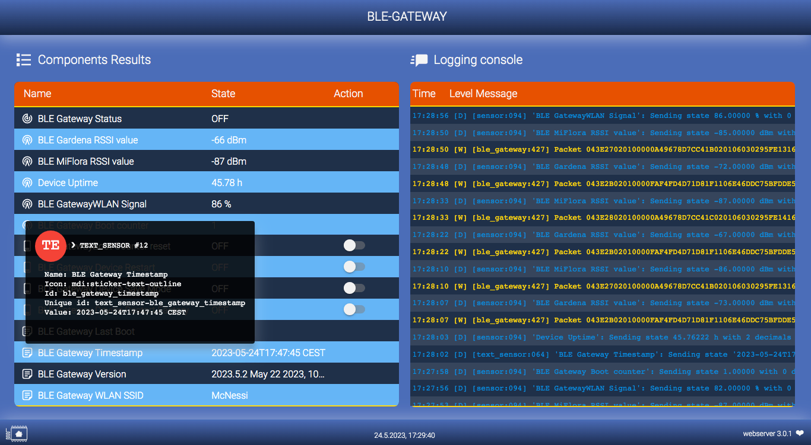

# ESPHOME Webserver



The web_server component creates a simple web server on the node that can be accessed through any browser and a simple REST API. 

> Please note that enabling the component with `local: true` will take up a lot of memory and can lead to problems, especially on the ESP8266.

see: <https://esphome.io/components/web_server.html?highlight=webserver>

In order to save memory, I don't use the ESP WEBserver, but my own version that I have installed on my server.


| Version |Configuration |Description |
| --- | ----------- | ----------- |
| Esphome V1 | web_server:<br> port: 80 <br>version: 1.0<br>local: true|  Add css and javascript to memory !  **High memory consumption**  |
| Esphome V1 | web_server:<br> port: 80 <br>version: 1.0<br>local: false |  Loads css and javascript from ESPHOME.io  **Low memory consumption**   |
| Esphome V2 | web_server:<br> port: 80 <br>version: 2.0<br>local: true|  Add css and javascript to memory ! **High memory consumption** |
| Esphome V2 | web_server:<br> port: 80 <br>version: 2.0<br>local: false |  Loads css and javascript from ESPHOME.io.  **Low memory consumption**   |
| **Webserver** Version V1, V2, V3 | web_server:<br> port: 80 <br>version: 2.0<br>js_url: "http://webserver.local/esphome/v2/www.js"|  Loads css and javascript from local webserver. **Low memory consumption**   |

<br>


## Configuration variables:

 - **css_url**: The URL that should be used for the CSS stylesheet. Defaults to https://esphome.io/_static/webserver-v1.min.css. This is only for version 1.0 Webserver. Change this to your webserver settings.
 
 - **js_url** : The URL that should be used for the JS script. Defaults to https://esphome.io/_static/webserver-v1.min.js. Change this to your webserver settings.

<br> 

## Installation

1. Copy the web server files from Github to your web server. 
2. Change the settings in the ESPHOME application 
3. Create the ESPHOME application


## Configuration examples


### Version 1.0

```yaml
## ---------------------------------------------------
## COMPONENT WEBSERVER V1 PRIVATE WEBSERVER
## ---------------------------------------------------
web_server:
  port: 80
  version: 1.0
  js_url: "http://webserver.local/esphome/v3/webserver.js"
  css_url: "http://webserver.local/esphome/v3/webserver.css"
```

### Version 2.0

```yaml
## ---------------------------------------------------
## COMPONENT WEBSERVER V2 PRIVATE WEBSERVER
## ---------------------------------------------------
web_server:
  port: 80
  version: 2.0
  js_url: "http://webserver.local/esphome/v2/www.js"
```


### Version 3.0

```yaml
## ---------------------------------------------------
## COMPONENT WEBSERVER V3 PRIVATE WEBSERVER
## ---------------------------------------------------
web_server:
  port: 80
  version: 2.0
  js_url: "http://webserver.local/esphome/webserver/v3/www.js"
```
